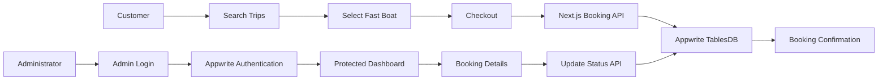

# GiliGo — Fast Boat Booking Platform


GiliGo is a full-stack fast boat booking platform designed for routes between Bali, the Gili Islands, and nearby destinations.

The application demonstrates a complete booking workflow, including trip search, passenger checkout, booking confirmation, secure admin authentication, and booking management backed by Appwrite.

## Live Demo

**Website:** https://nusagiliboat.com

**Admin page:** https://nusagiliboat.com/admin

> Admin credentials are private and are not included in this repository.

## Main Features

### Customer Booking

* Search trips by departure port and destination
* Select departure date and number of passengers
* View available fast boat schedules
* Compare operator, travel time, facilities, and pricing
* Complete passenger and customer information
* Submit a booking
* Receive a unique booking reference
* View a booking confirmation page

### Admin Management

* Secure email and password authentication
* Protected admin dashboard
* View total bookings, passengers, booking value, and upcoming trips
* View customer, passenger, route, and payment details
* Update booking status
* Update payment status
* Persist status changes to Appwrite
* Secure logout and session management

### Security

* Server-side Appwrite integration
* HttpOnly session cookie
* Protected admin pages
* Protected booking update API
* Environment variables excluded from Git
* API key used only on the server

## Technology Stack

| Category        | Technology             |
| --------------- | ---------------------- |
| Framework       | Next.js App Router     |
| Language        | TypeScript             |
| Frontend        | React                  |
| Styling         | Tailwind CSS           |
| Backend         | Next.js Route Handlers |
| Database        | Appwrite TablesDB      |
| Authentication  | Appwrite Auth          |
| Hosting         | Vercel                 |
| Version Control | Git and GitHub         |

## Application Flow



## Project Structure

```text
src/
├── app/
│   ├── admin/
│   │   ├── bookings/
│   │   │   └── [id]/
│   │   ├── login/
│   │   └── page.tsx
│   ├── api/
│   │   ├── admin/
│   │   │   ├── login/
│   │   │   └── logout/
│   │   └── bookings/
│   │       └── [id]/
│   ├── booking/
│   │   └── [code]/
│   ├── checkout/
│   ├── search/
│   └── page.tsx
├── components/
├── data/
└── lib/
    ├── admin-auth.ts
    └── appwrite-server.ts
```

## Booking Data

Each booking record contains information such as:

* Booking code
* Booking status
* Payment status
* Trip type
* Departure and return dates
* Passenger count
* Customer information
* Passenger details
* Route and operator information
* Departure and arrival times
* Price per passenger
* Total booking value
* Check-in location
* Additional notes

## Local Installation

### 1. Clone the repository

```bash
git clone https://github.com/loctate/giligo-fast-boat-booking.git
cd giligo-fast-boat-booking
```

### 2. Install dependencies

```bash
npm install
```

### 3. Configure environment variables

Create a file named `.env.local` in the project root:

```env
APPWRITE_ENDPOINT=https://sgp.cloud.appwrite.io/v1
APPWRITE_PROJECT_ID=your_project_id
APPWRITE_API_KEY=your_server_api_key
APPWRITE_DATABASE_ID=your_database_id
APPWRITE_BOOKINGS_TABLE_ID=your_bookings_table_id

ADMIN_EMAIL=your_admin_email
ADMIN_SESSION_COOKIE=giligo_admin_session
```

Never commit `.env.local` or expose the Appwrite API key publicly.

### 4. Start the development server

```bash
npm run dev
```

Open:

```text
http://localhost:3000
```

### 5. Create a production build

```bash
npm run build
npm run start
```

## Appwrite Configuration

The project requires:

1. An Appwrite Cloud project
2. A TablesDB database
3. A `bookings` table
4. A server API key with the required database and session permissions
5. An Appwrite Auth user for administrator access
6. Web platforms for localhost and the production Vercel hostname

The production hostname used by this project is:

```text
nusagiliboat.com
```

## Environment Variables

| Variable                     | Description                                   |
| ---------------------------- | --------------------------------------------- |
| `APPWRITE_ENDPOINT`          | Appwrite Cloud API endpoint                   |
| `APPWRITE_PROJECT_ID`        | Appwrite project identifier                   |
| `APPWRITE_API_KEY`           | Private server API key                        |
| `APPWRITE_DATABASE_ID`       | Appwrite database identifier                  |
| `APPWRITE_BOOKINGS_TABLE_ID` | Bookings table identifier                     |
| `ADMIN_EMAIL`                | Email permitted to access the admin dashboard |
| `ADMIN_SESSION_COOKIE`       | Name of the admin session cookie              |

## API Routes

| Method  | Route                | Purpose                           |
| ------- | -------------------- | --------------------------------- |
| `POST`  | `/api/bookings`      | Create a booking                  |
| `PATCH` | `/api/bookings/[id]` | Update booking and payment status |
| `POST`  | `/api/admin/login`   | Authenticate the administrator    |
| `POST`  | `/api/admin/logout`  | End the administrator session     |

## Deployment

The application is deployed on Vercel.

Deployment process:

1. Push the project to GitHub
2. Import the repository into Vercel
3. Add all environment variables
4. Deploy the Next.js application
5. Register the Vercel hostname as an Appwrite Web Platform
6. Test the customer and administrator workflows

## Current Project Status

GiliGo is a functional portfolio MVP.

The current version includes:

* End-to-end booking workflow
* Persistent Appwrite database
* Secure administrator authentication
* Booking and payment status management
* Responsive customer and admin interfaces
* Production deployment

Possible future improvements include:

* Real payment gateway integration
* Live operator schedules
* Seat inventory management
* Booking email notifications
* Search filters and sorting
* Booking cancellation workflow
* Customer booking lookup
* Operator management
* PDF or digital ticket generation

## Important Notice

Trip schedules, operators, prices, and transactions shown in this project are demonstration data.

This project is intended for portfolio, learning, and demonstration purposes and is not currently connected to real fast boat operators or a live payment provider.

## Author

**Bonar Sulaiman**

* GitHub: [@loctate](https://github.com/loctate)
* LinkedIn: [linkedin.com/in/bonarsulaiman](https://www.linkedin.com/in/bonarsulaiman/)

---

Built as a full-stack portfolio project using Next.js, TypeScript, Appwrite, and Vercel.
