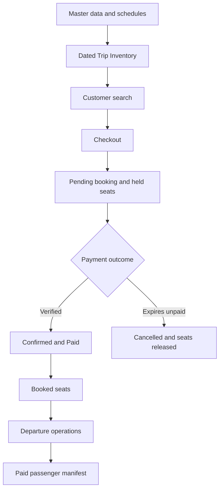
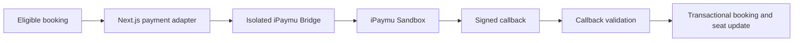
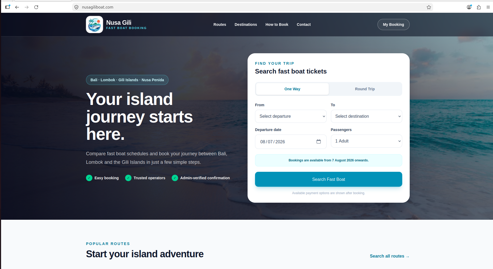
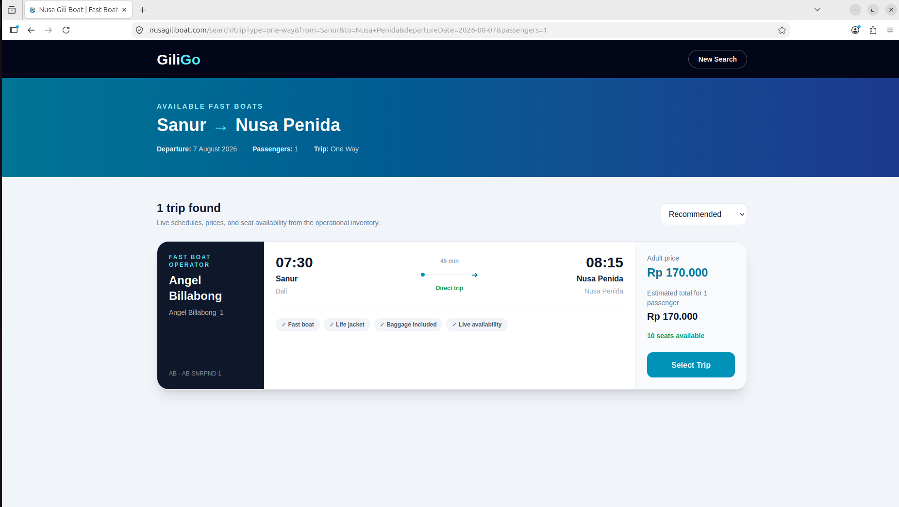
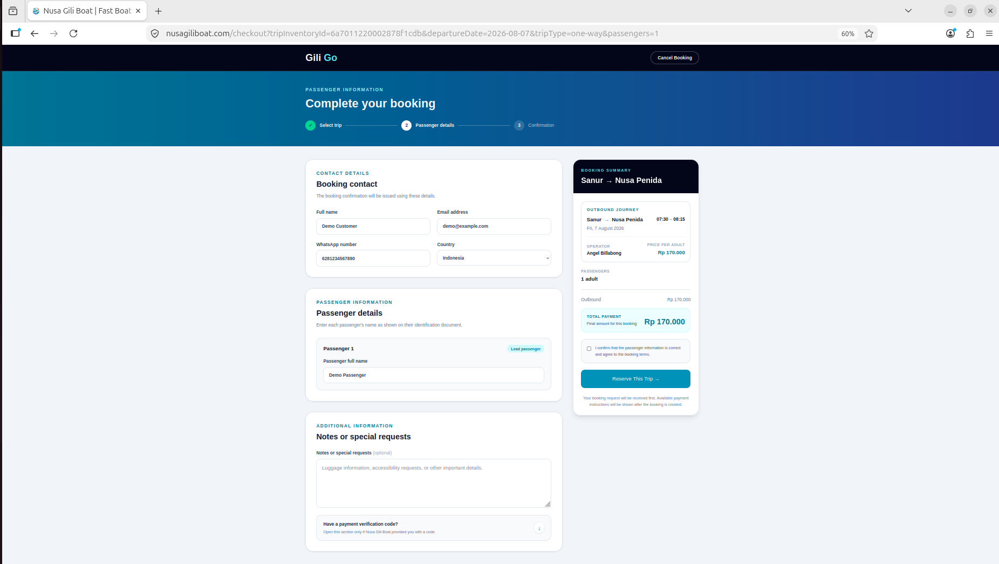
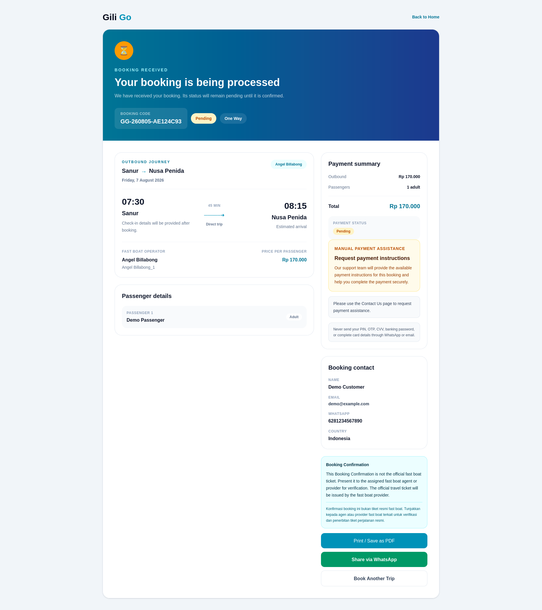
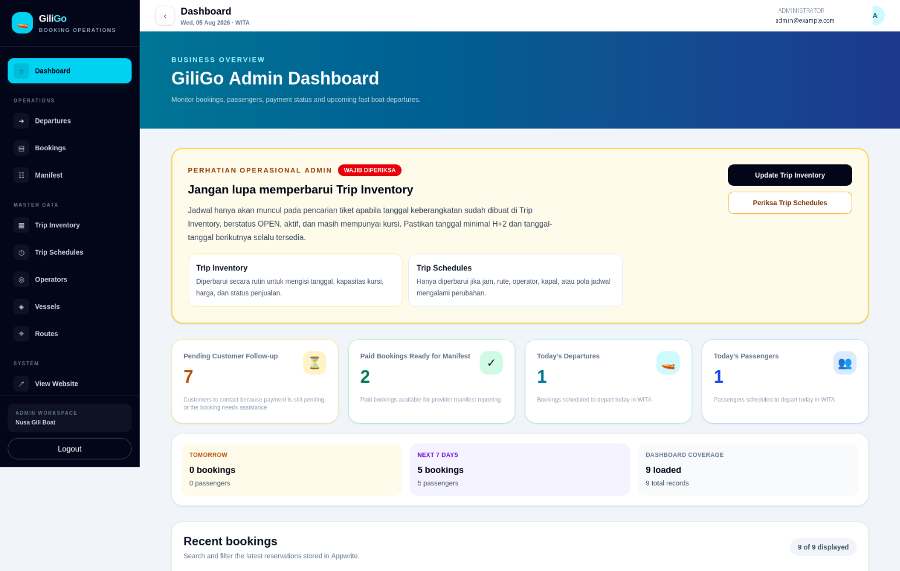
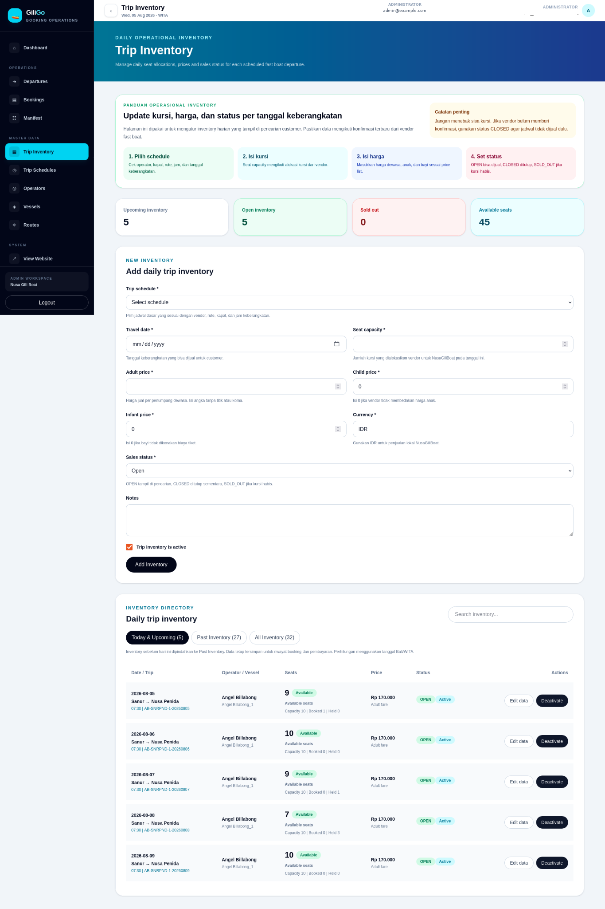
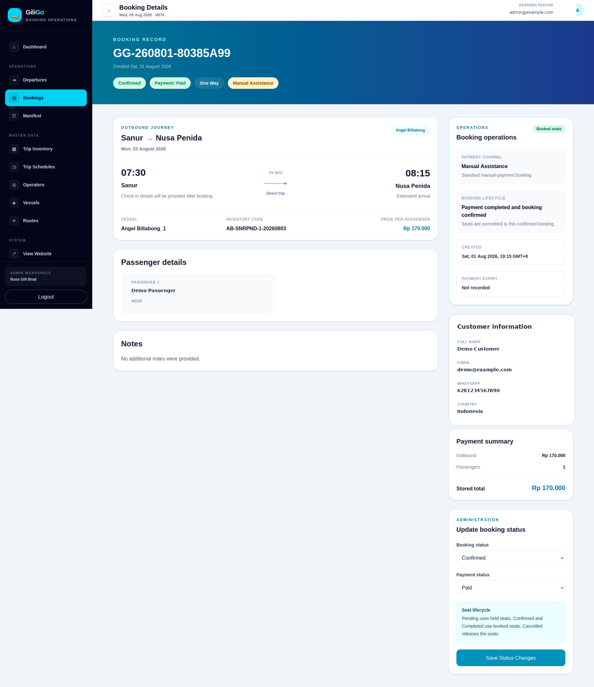
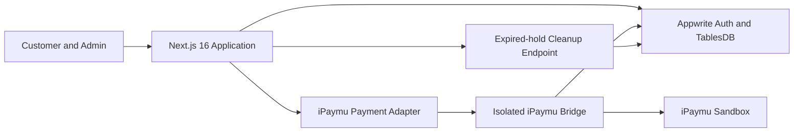

<p align="center">
  
</p>

# GiliGo — Fast Boat Booking Operations Platform

> Turning fragmented trip scheduling, seat availability, customer booking, payment follow-up, departure preparation, and passenger manifest work into one practical digital workflow.

[](https://nextjs.org/)
[](https://www.typescriptlang.org/)
[](https://appwrite.io/)
[](#current-status)
[](#payment-scope)

| | |
|---|---|
| **Status** | Production-deployed operational MVP |
| **Project type** | Independent business systems portfolio project |
| **Public payment flow** | Manual payment assistance with admin verification |
| **Payment engineering** | Controlled iPaymu Sandbox integration |
| **Operational data** | Demonstration data |
| **Maintenance** | Active |

## Live Demo

- **Public website:** https://nusagiliboat.com
- **Admin portal:** https://nusagiliboat.com/admin

> Admin access is private. The public deployment uses demonstration schedules, inventory, operators, prices, bookings, and transactions. It is not presented as a live marketplace connected to real fast boat operators.

---

## Why This Project Exists

Fast boat operations combine several processes that are often handled separately through spreadsheets, chat messages, and manual records:

- schedules, routes, vessels, prices, and departure dates;
- seat availability and temporary reservations;
- one-way and round-trip bookings;
- payment follow-up and verification;
- booking and payment status changes;
- departure preparation;
- paid passenger manifests.

When these records are disconnected, staff can face inconsistent availability, long payment follow-up, unclear departure lists, and manifests that include incomplete bookings.

GiliGo turns those manual processes into one structured operational workflow.

---

## What the System Does

### Customer journey

- Search one-way and round-trip journeys.
- Select origin, destination, dates, and passenger count.
- View only active inventory with enough remaining seats.
- Compare operator, vessel, schedule, travel time, price, and availability.
- Complete checkout and receive a booking reference.
- Look up a booking using booking code and customer email.
- View booking, payment, passenger, trip, and seat-hold details.

### Operations and administration

- Manage operators, vessels, routes, recurring schedules, and dated inventory.
- Search and filter bookings by customer, booking code, operator, route, status, payment, or departure date.
- Update booking and payment statuses.
- Adjust held and booked seats transactionally.
- Review upcoming departures using WITA operational dates.
- View operational dashboard metrics.
- Generate and print departure-specific paid passenger manifests.

### Payment engineering

- Public customers currently use manual payment assistance.
- A separate iPaymu Bridge supports controlled Sandbox verification.
- The bridge handles signatures, callbacks, idempotency, timeouts, duplicate events, seat transitions, and late-payment review.

---

## End-to-End Workflow


```mermaid
flowchart TD
    A[Master data and schedules]
    --> B[Dated Trip Inventory]
    --> C[Customer search]
    --> D[Checkout]
    --> E[Pending booking and held seats]

    E --> F{Payment outcome}

    F -->|Verified| G[Confirmed and Paid]
    F -->|Expires unpaid| H[Cancelled and seats released]

    G --> I[Booked seats]
    --> J[Departure operations]
    --> K[Paid passenger manifest]
```

The controlled iPaymu path runs beside the public manual-payment flow:


```mermaid
flowchart LR
    A[Eligible booking]
    --> B[Next.js payment adapter]
    --> C[Isolated iPaymu Bridge]
    --> D[iPaymu Sandbox]

    D --> E[Signed callback]
    --> F[Callback validation]
    --> G[Transactional booking and seat update]
```

---

## Core Business Rules

### Seat availability

```text
availableSeats = seatCapacity - bookedSeats - heldSeats
```

### Initial booking state

```text
bookingStatus = Pending
paymentStatus = Pending
```

### Status-to-seat relationship

| Booking status | Seat position |
|---|---|
| `Pending` | Held |
| `Confirmed` | Booked |
| `Completed` | Booked |
| `Cancelled` | Released |

### Search eligibility

A journey appears in search only when:

- the dated inventory is active;
- sales status is `OPEN`;
- the travel date is still bookable;
- related route, schedule, operator, and vessel records are active;
- the requested passenger count fits the remaining capacity.

### Expired unpaid bookings

The cleanup process:

1. verifies that the booking is still `Pending/Pending`;
2. releases outbound and return held seats;
3. reopens eligible automatically sold-out inventory;
4. changes the booking to `Cancelled`;
5. commits booking and inventory updates atomically.

### Manifest eligibility

```text
(Confirmed OR Completed) AND Paid
```

Only bookings meeting this rule appear in the final provider manifest.

---

## Feature Highlights

| Area | Highlights |
|---|---|
| **Search** | One-way and return journeys, route/date/passenger validation |
| **Inventory** | Dated capacity, booked seats, held seats, sold-out handling |
| **Checkout** | Customer and passenger records, unique booking reference |
| **Booking operations** | Lookup, filters, booking status, payment status |
| **Master data** | Operators, vessels, routes, schedules |
| **Departure operations** | WITA-based upcoming departures and passenger totals |
| **Manifest** | Paid-passenger eligibility and printable provider layout |
| **Payment** | Manual public flow plus isolated iPaymu Sandbox bridge |
| **Languages** | English and Indonesian public information pages |
| **Deployment** | Public domain, Vercel frontend, Appwrite backend |

---

## Screenshots

### Customer booking flow

<table>
  <tr>
    <td width="50%" align="center">
      <strong>Public trip search</strong><br>
      
    </td>
    <td width="50%" align="center">
      <strong>Available trip results</strong><br>
      
    </td>
  </tr>
  <tr>
    <td width="50%" align="center">
      <strong>Passenger checkout</strong><br>
      
    </td>
    <td width="50%" align="center">
      <strong>Booking confirmation</strong><br>
      
    </td>
  </tr>
</table>

### Operational administration

<table>
  <tr>
    <td width="50%" align="center">
      <strong>Operational dashboard</strong><br>
      
    </td>
    <td width="50%" align="center">
      <strong>Dated trip inventory</strong><br>
      
    </td>
  </tr>
  <tr>
    <td colspan="2" align="center">
      <strong>Booking and seat lifecycle operations</strong><br>
      
    </td>
  </tr>
</table>

---

## Architecture


```mermaid
flowchart LR
    U[Customer and Admin]
    --> W[Next.js 16 Application]

    W --> A[Appwrite Auth and TablesDB]
    W --> P[iPaymu Payment Adapter]
    W --> C[Expired-hold Cleanup Endpoint]

    P --> B[Isolated iPaymu Bridge]
    B --> I[iPaymu Sandbox]
    B --> A

    C --> A
```

### Main components

| Component | Responsibility |
|---|---|
| **Next.js application** | Public booking flow, admin operations, APIs, booking lookup |
| **Appwrite** | Authentication, master data, trip inventory, bookings, transactions |
| **iPaymu Bridge** | Provider requests, callback validation, payment lifecycle |
| **Cleanup scheduler** | Releases expired held seats and cancels unpaid bookings |
| **Vercel** | Public web deployment |

---

## Engineering Decisions

### Separate reusable master data from dated inventory

Routes and recurring schedules are reusable. Price, capacity, vessel assignment, availability, and sales status can change for each travel date, so they belong to Trip Inventory.

### Preserve booking snapshots

Bookings store route, operator, vessel, times, price, and check-in details so later master-data changes do not rewrite historical booking information.

### Use temporary seat state

A separate `heldSeats` value prevents customers still completing payment from being treated as confirmed sales while still protecting capacity.

### Apply transactional lifecycle updates

Booking creation, status changes, payment callbacks, and expiration cleanup update booking and inventory records through Appwrite transactions.

### Isolate payment-provider logic

Provider credentials, signatures, callbacks, and transport logic run in a separate server-side bridge instead of the public web application.

### Fail closed

The controlled online-payment path remains blocked when required configuration is absent or invalid.

### Use the operational timezone

Departure and dashboard calculations use `Asia/Makassar` (WITA), matching Bali operations.

---

## Payment Scope

### Public flow

The public website currently provides manual payment assistance. An administrator verifies payment before confirming the booking.

### Controlled iPaymu Sandbox flow

The isolated bridge supports:

- signed redirect-payment requests;
- internal bearer-token authentication;
- callback signature validation;
- JSON and URL-encoded callback payloads;
- idempotency and duplicate handling;
- transaction timeouts;
- atomic booking and seat transitions;
- expired-payment seat release;
- late-success manual review;
- sanitized diagnostics;
- health and readiness endpoints.

It is a tested Sandbox integration, not the default live public payment flow.

Production activation remains dependent on iPaymu merchant approval, production credentials, and provider-side response times. Until those external dependencies are resolved, the public workflow remains manual.

See [`services/ipaymu-bridge/README.md`](services/ipaymu-bridge/README.md).

---

## Security and Reliability

- Server-side Appwrite API access.
- Appwrite Auth administrator sessions.
- HttpOnly session cookies.
- `Secure` cookies in production.
- `SameSite=Strict` session policy.
- Administrator email allow-list.
- Protected admin pages and mutation APIs.
- No-store booking and payment lookup responses.
- Constant-time cleanup-secret comparison.
- HTTPS validation for payment and callback URLs.
- Internal bearer token between the application and payment bridge.
- Callback signature verification.
- Provider timeout and request-size handling.
- Sanitized logs that avoid exposing secrets.
- Transaction rollback paths.
- Non-root payment-service container.

---

## Technology Stack

| Area | Technology |
|---|---|
| Web framework | Next.js 16 App Router |
| Language | TypeScript 5 |
| UI | React 19 |
| Styling | Tailwind CSS 4 |
| Backend APIs | Next.js Route Handlers |
| Database | Appwrite TablesDB |
| Authentication | Appwrite Auth |
| Payment service | Node.js iPaymu Bridge |
| Payment environment | iPaymu Sandbox |
| Packaging | Docker |
| Scheduled cleanup | Bash and systemd |
| Deployment | Vercel |
| Timezone | Asia/Makassar (WITA) |

---

## Validation

Validated against commit:

```text
e6447210dae2ae701c432a2871599f3742c055b7
```

| Check | Result |
|---|---|
| ESLint | Passed with 0 errors and 1 image-optimization warning |
| TypeScript | Passed |
| Next.js production build | Passed |
| Application pages | 28 |
| API routes | 19 |
| Protected admin pages | 11 |
| iPaymu Bridge tests | 106 passed |
| Failed bridge tests | 0 |
| Skipped bridge tests | 0 |

<details>
<summary><strong>Testing scope</strong></summary>

The bridge suite covers:

- configuration and readiness;
- request and callback signatures;
- provider request and response handling;
- authorization guards;
- callback parsing;
- runtime dependency wiring;
- Appwrite lifecycle integration;
- held-to-booked transitions;
- expired-seat release;
- duplicate callbacks;
- transaction rollback;
- late-success review;
- sanitized observability.

The main Next.js application does not yet have an equivalent automated test suite. It is currently validated through linting, TypeScript, production builds, and manual workflow testing.

</details>

---

## Current Status

GiliGo is a **production-deployed operational MVP**.

It is production-deployed because the public application is available on its own domain and passes a production build.

It remains an MVP because:

- the public deployment uses demonstration operational data;
- it is not connected to real fast boat operators;
- public payment currently uses manual assistance;
- iPaymu is a controlled Sandbox path;
- several customer-facing operational features remain on the roadmap.

---

## Known Limitations

- No connection to real operator APIs or live provider schedules.
- Public schedules, inventory, operators, prices, bookings, and transactions are demonstration data.
- No automated booking email notification service.
- No downloadable PDF or PNG customer ticket.
- No QR-based ticket verification.
- No comprehensive automated test suite for the main Next.js application.
- Booking-code uniqueness is not yet enforced through a database unique index.
- One homepage image-optimization lint warning remains.

---

## My Role

I designed and developed GiliGo as an independent business systems project.

My work included:

- translating manual booking operations into application workflows;
- defining booking, payment, inventory, departure, and manifest rules;
- designing the Appwrite data model;
- building the public booking journey;
- building protected administrator operations;
- implementing master-data and dated-inventory management;
- implementing transactional seat holds and releases;
- designing WITA-based operational dashboard metrics;
- building departure and manifest workflows;
- isolating iPaymu into a server-side payment bridge;
- implementing callback validation, lifecycle safeguards, and observability;
- preparing deployment, cleanup scheduler, and rollback documentation;
- validating the system through static checks, production builds, and automated bridge tests.

---

## Lessons Learned

### Model the process before adding features

The hardest and most valuable work was defining how schedules, dated inventory, booking statuses, payment statuses, seat positions, and manifests relate to one another.

### Payment integration is a lifecycle

Creating a provider transaction is only one step. A reliable flow must also handle callback authentication, duplicates, expiration, seat release, late success, rollback, and manual review.

### Inventory needs temporary state

Available and booked seats are not enough while customers are completing payment. A held-seat state protects capacity without treating an unpaid booking as a completed sale.

### Honest positioning strengthens credibility

This project is presented as a deployed operational portfolio MVP with demonstration data and Sandbox payment engineering—not as a live commercial marketplace.

---

## Local Development

<details>
<summary><strong>Installation and validation</strong></summary>

### Requirements

- Node.js 24
- npm 11
- Appwrite project with the required TablesDB tables
- Appwrite administrator account
- Optional Docker runtime for the iPaymu Bridge

### Install

```bash
git clone https://github.com/loctate/giligo-fast-boat-booking.git
cd giligo-fast-boat-booking
npm install
cp .env.example .env.local
```

Add private development values to `.env.local`. Never commit real credentials.

### Run

```bash
npm run dev
```

### Validate

```bash
npm run lint
npx --no-install tsc --noEmit
npm run build
npm --prefix services/ipaymu-bridge test
```

</details>

---

## Roadmap

- Automated booking email notifications.
- Customer ticket export as PDF or PNG.
- QR-based ticket verification.
- Automated tests for the main Next.js application.
- Database-level booking-code uniqueness.
- Optional real operator inventory integrations.

---

## Author

**Bonar Sulaiman**

- GitHub: [@loctate](https://github.com/loctate)
- LinkedIn: [linkedin.com/in/bonarsulaiman](https://www.linkedin.com/in/bonarsulaiman/)

---

Built to demonstrate how manual travel-booking operations can be transformed into a practical digital system.
