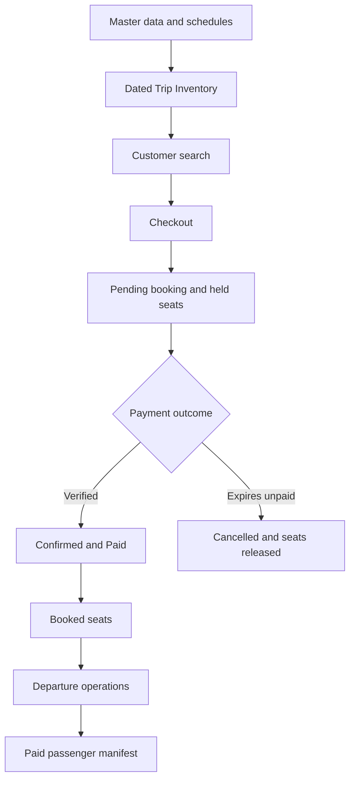
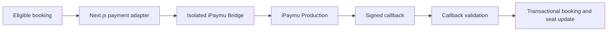
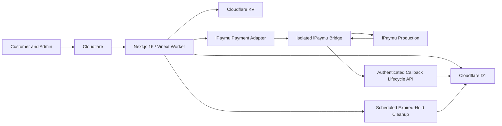

<p align="center">
  
</p>

# NusaGiliBoat — Fast Boat Booking & Operations Platform

> Turning fragmented trip scheduling, seat availability, customer booking, payment follow-up, departure preparation, and passenger manifest work into one practical digital workflow.

[](https://nextjs.org/)
[](https://www.typescriptlang.org/)
[](https://www.cloudflare.com/)
[](#current-status)
[](#payment-scope)

| | |
|---|---|
| **Status** | Production operational |
| **Project type** | Independent production business systems project |
| **Public payment flow** | Online iPaymu checkout with manual operational fallback |
| **Payment engineering** | Dedicated production iPaymu Bridge |
| **Infrastructure** | Cloudflare Workers, D1, KV, and payment bridge |
| **Maintenance** | Active / production monitoring |

## Live Demo

- **Public website:** https://nusagiliboat.com
- **Admin portal:** https://nusagiliboat.com/admin

> Admin access is private. NusaGiliBoat is an independently operated production booking system. It is not presented as an official booking platform of any individual fast boat operator and does not rely on direct operator APIs.

---

## Why This Project Exists

Fast boat operations combine several processes that are often handled separately through spreadsheets, chat messages, and manual records:

- schedules, routes, vessels, prices, and departure dates;
- seat availability and temporary reservations;
- one-way and round-trip bookings;
- payment follow-up and verification;
- booking and payment status changes;
- departure preparation;
- paid passenger manifests.

When these records are disconnected, staff can face inconsistent availability, long payment follow-up, unclear departure lists, and manifests that include incomplete bookings.

GiliGo turns those manual processes into one structured operational workflow.

---

## What the System Does

### Customer journey

- Search one-way and round-trip journeys.
- Select origin, destination, dates, and passenger count.
- View only active inventory with enough remaining seats.
- Compare operator, vessel, schedule, travel time, price, and availability.
- Complete checkout and receive a booking reference.
- Look up a booking using booking code and customer email.
- View booking, payment, passenger, trip, and seat-hold details.

### Operations and administration

- Manage operators, vessels, routes, recurring schedules, and dated inventory.
- Search and filter bookings by customer, booking code, operator, route, status, payment, or departure date.
- Update booking and payment statuses.
- Adjust held and booked seats transactionally.
- Review upcoming departures using WITA operational dates.
- View operational dashboard metrics.
- Generate and print departure-specific paid passenger manifests.

### Payment engineering

- Public customers can initiate online payment through iPaymu.
- A dedicated iPaymu Bridge isolates payment-provider credentials and transport logic from the public application.
- The bridge handles signed requests, callbacks, idempotency, timeouts, duplicate events, seat transitions, and late-payment review.
- Production payment-session creation has been validated against the live iPaymu environment.
- Full paid-settlement callback verification remains an operational follow-up because no paid production QA transaction was intentionally performed during cutover testing.

---

## End-to-End Workflow


```mermaid
flowchart TD
    A[Master data and schedules]
    --> B[Dated Trip Inventory]
    --> C[Customer search]
    --> D[Checkout]
    --> E[Pending booking and held seats]

    E --> F{Payment outcome}

    F -->|Verified| G[Confirmed and Paid]
    F -->|Expires unpaid| H[Cancelled and seats released]

    G --> I[Booked seats]
    --> J[Departure operations]
    --> K[Paid passenger manifest]
```

The controlled iPaymu path runs beside the public manual-payment flow:


```mermaid
flowchart LR
    A[Eligible booking]
    --> B[Next.js payment adapter]
    --> C[Isolated iPaymu Bridge]
    --> D[iPaymu Production]

    D --> E[Signed callback]
    --> F[Callback validation]
    --> G[Transactional booking and seat update]
```

---

## Core Business Rules

### Seat availability

```text
availableSeats = seatCapacity - bookedSeats - heldSeats
```

### Initial booking state

```text
bookingStatus = Pending
paymentStatus = Pending
```

### Status-to-seat relationship

| Booking status | Seat position |
|---|---|
| `Pending` | Held |
| `Confirmed` | Booked |
| `Completed` | Booked |
| `Cancelled` | Released |

### Search eligibility

A journey appears in search only when:

- the dated inventory is active;
- sales status is `OPEN`;
- the travel date is still bookable;
- related route, schedule, operator, and vessel records are active;
- the requested passenger count fits the remaining capacity.

### Expired unpaid bookings

The cleanup process:

1. verifies that the booking is still `Pending/Pending`;
2. releases outbound and return held seats;
3. reopens eligible automatically sold-out inventory;
4. changes the booking to `Cancelled`;
5. commits booking and inventory updates atomically.

### Manifest eligibility

```text
(Confirmed OR Completed) AND Paid
```

Only bookings meeting this rule appear in the final provider manifest.

---

## Feature Highlights

| Area | Highlights |
|---|---|
| **Search** | One-way and return journeys, route/date/passenger validation |
| **Inventory** | Dated capacity, booked seats, held seats, sold-out handling |
| **Checkout** | Customer and passenger records, unique booking reference |
| **Booking operations** | Lookup, filters, booking status, payment status |
| **Master data** | Operators, vessels, routes, schedules |
| **Departure operations** | WITA-based upcoming departures and passenger totals |
| **Manifest** | Paid-passenger eligibility and printable provider layout |
| **Payment** | Production iPaymu integration through isolated payment bridge |
| **Languages** | English and Indonesian public information pages |
| **Deployment** | Cloudflare Workers / Vinext, Cloudflare D1, Cloudflare KV |

---

## Screenshots

### Customer booking flow

<table>
  <tr>
    <td width="50%" align="center">
      <strong>Public trip search</strong><br>
      
    </td>
    <td width="50%" align="center">
      <strong>Available trip results</strong><br>
      
    </td>
  </tr>
</table>

<p align="center">
  <strong>Passenger checkout</strong>
</p>

<p align="center">
  
</p>

<p align="center">
  <strong>Booking confirmation</strong>
</p>

<p align="center">
  
</p>

### Operational administration

<p align="center">
  <strong>Operational dashboard</strong>
</p>

<p align="center">
  
</p>

<p align="center">
  <strong>Dated trip inventory</strong>
</p>

<p align="center">
  
</p>

<p align="center">
  <strong>Booking and seat lifecycle operations</strong>
</p>

<p align="center">
  
</p>

---

## Architecture


```mermaid
flowchart LR
    U[Customer and Admin] --> CF[Cloudflare]
    CF --> W[Next.js 16 / Vinext Worker]

    W --> D1[Cloudflare D1]
    W --> KV[Cloudflare KV]
    W --> P[iPaymu Payment Adapter]

    P --> B[Isolated iPaymu Bridge]
    B --> I[iPaymu Production]

    I --> B
    B --> C[Authenticated Callback Lifecycle API]
    C --> D1

    W --> X[Scheduled Expired-Hold Cleanup]
    X --> D1
```

### Main components

| Component | Responsibility |
|---|---|
| **Next.js / Vinext application** | Public booking flow, admin operations, APIs, booking lookup |
| **Cloudflare D1** | Master data, dated inventory, bookings, and lifecycle state |
| **Cloudflare KV** | Runtime and cache support |
| **iPaymu Bridge** | Provider requests, callback validation, and payment lifecycle isolation |
| **Scheduled cleanup** | Releases expired held seats and cancels unpaid bookings |
| **Cloudflare Workers** | Production application runtime |
---

## Production Migration & Cutover

The application was migrated from a traditional VPS-oriented deployment to a Cloudflare-first architecture while preserving the existing customer booking and operational workflows.

The migration included:

- upgrading the application for Vinext and Cloudflare Workers compatibility;
- migrating operational data to Cloudflare D1;
- adding Cloudflare KV for runtime and cache support;
- adapting booking creation, availability, lookup, expiry, admin operations, and manifests to D1;
- preserving the isolated iPaymu payment bridge;
- adding an authenticated HTTP lifecycle boundary for payment callbacks;
- creating and verifying production backups before cutover;
- performing controlled deployment and production smoke testing;
- validating customer, admin, inventory, payment-session, and manifest workflows;
- retiring the legacy VPS only after Cloudflare production passed operational QA.

### Production QA coverage

The final cutover validation covered:

```text
Search -> Trip Selection -> Checkout -> Booking Creation
       -> Seat Hold -> Policy Acceptance -> iPaymu Payment Session
```

Administrative production QA also covered authentication, dashboard access, trip inventory, departures, and provider manifests.

Expired unpaid QA bookings were verified to release held seats automatically.

Provider manifests were validated against the production rule:

```text
(Confirmed OR Completed) AND Paid
```

The legacy VPS was retired after the Cloudflare deployment became the production source of truth.

---

## Engineering Decisions

### Separate reusable master data from dated inventory

Routes and recurring schedules are reusable. Price, capacity, vessel assignment, availability, and sales status can change for each travel date, so they belong to Trip Inventory.

### Preserve booking snapshots

Bookings store route, operator, vessel, times, price, and check-in details so later master-data changes do not rewrite historical booking information.

### Use temporary seat state

A separate `heldSeats` value prevents customers still completing payment from being treated as confirmed sales while still protecting capacity.

### Protect lifecycle state across D1 operations

Booking creation, status changes, payment callbacks, and expiration cleanup use controlled D1 lifecycle adapters and guarded state transitions so booking state and seat inventory remain consistent.

### Isolate payment-provider logic

Provider credentials, signatures, callbacks, and transport logic run in a separate server-side bridge instead of the public web application.

### Fail closed

The controlled online-payment path remains blocked when required configuration is absent or invalid.

### Use the operational timezone

Departure and dashboard calculations use `Asia/Makassar` (WITA), matching Bali operations.

---

## Payment Scope

### Public flow

The public website can create production iPaymu payment sessions for eligible customer bookings.

Policy acceptance is recorded before payment-session creation, and unpaid bookings remain protected by temporary seat holds and automatic expiration.

### Production iPaymu Bridge

The isolated bridge supports:

- signed redirect-payment requests;
- internal bearer-token authentication;
- callback signature validation;
- JSON and URL-encoded callback payloads;
- idempotency and duplicate handling;
- transaction timeouts;
- guarded booking and seat transitions;
- expired-payment seat release;
- late-success manual review;
- sanitized diagnostics;
- health and readiness endpoints.

Production readiness and payment-session creation were verified during the Cloudflare production cutover.

A paid production settlement was intentionally not executed as part of QA, so the live provider success-callback path remains the main item to observe on the first real paid transaction.

See [`services/ipaymu-bridge/README.md`](services/ipaymu-bridge/README.md).
---

## Security and Reliability

- Protected administrator pages and mutation APIs.
- HttpOnly administrator session cookies.
- `Secure` cookies in production.
- `SameSite=Strict` session policy.
- Administrator email allow-list.
- Server-side password verification.
- No-store booking and payment lookup responses.
- Constant-time sensitive-token comparisons.
- HTTPS validation for payment and callback URLs.
- Internal bearer token between the application and payment bridge.
- Callback signature verification.
- Authenticated internal callback lifecycle endpoint.
- Provider timeout and request-size handling.
- Sanitized logs that avoid exposing secrets.
- Fail-closed payment configuration.
- Non-root payment-service container.
---

## Technology Stack

| Area | Technology |
|---|---|
| Web framework | Next.js 16 App Router |
| Language | TypeScript 5 |
| UI | React 19 |
| Styling | Tailwind CSS 4 |
| Backend APIs | Next.js Route Handlers |
| Database | Cloudflare D1 |
| Runtime cache | Cloudflare KV |
| Authentication | Protected administrator session |
| Payment service | Node.js iPaymu Bridge |
| Payment environment | iPaymu Production |
| Packaging | Docker |
| Scheduled cleanup | Cloudflare scheduled Worker |
| Runtime / deployment | Cloudflare Workers with Vinext |
| Analytics | Google Tag Manager + Google Analytics 4 |
| Timezone | Asia/Makassar (WITA) |
---

## Production Validation

Production cutover validation was completed in September 2026.

Validated areas include:

- Cloudflare Workers / Vinext production deployment;
- Cloudflare D1 production data and lifecycle operations;
- route search and seat availability;
- customer checkout and booking creation;
- temporary seat holds and automatic seat release;
- customer booking lookup;
- Terms and Refund Policy acceptance;
- iPaymu production payment-session creation;
- administrator authentication and dashboard access;
- Trip Inventory and departure operations;
- provider-ready passenger manifests.

The iPaymu bridge health, readiness, and production checkout-session flow were verified successfully.

A deliberately paid production QA transaction was not performed, so the first real successful payment remains an operational verification point for the provider success-callback and final `Confirmed / Paid` transition.

The payment bridge also maintains an automated test suite covering signatures, callback handling, lifecycle safeguards, duplicate events, timeouts, and failure scenarios.
---

## Current Status

NusaGiliBoat is a **production operational fast boat booking and operations platform**.

The public application, booking APIs, Cloudflare D1 database, customer booking lookup, seat lifecycle, admin operations, manifest workflow, scheduled expiration handling, and iPaymu payment-session creation have been validated in production.

The platform was migrated from its previous VPS-oriented architecture to a Cloudflare-first runtime and database architecture.

Schedules and inventory are currently maintained through the administrator workflow rather than direct fast boat operator APIs.
---

## Known Limitations

- No direct connection to fast boat operator APIs or provider inventory feeds.
- Schedules and dated inventory are maintained administratively.
- Full paid iPaymu settlement and success-callback behavior has not yet been exercised through a deliberately paid production QA transaction.
- No automated booking email notification service.
- No downloadable PDF or PNG customer ticket.
- No QR-based ticket verification.
- No comprehensive automated test suite for the main Next.js application.
- Booking-code uniqueness is not yet enforced through a database unique index.
- Minor non-blocking lint warnings remain.
---

## My Role

I designed and developed GiliGo as an independent business systems project.

My work included:

- translating manual booking operations into application workflows;
- defining booking, payment, inventory, departure, and manifest rules;
- designing and migrating the production booking data model to Cloudflare D1;
- building the public booking journey;
- building protected administrator operations;
- implementing master-data and dated-inventory management;
- implementing guarded seat holds, releases, and lifecycle transitions;
- designing WITA-based operational dashboard metrics;
- building departure and manifest workflows;
- isolating iPaymu into a server-side payment bridge;
- implementing callback validation, lifecycle safeguards, and observability;
- preparing deployment, cleanup scheduler, and rollback documentation;
- validating the system through static checks, production builds, and automated bridge tests.

---

## Lessons Learned

### Model the process before adding features

The hardest and most valuable work was defining how schedules, dated inventory, booking statuses, payment statuses, seat positions, and manifests relate to one another.

### Payment integration is a lifecycle

Creating a provider transaction is only one step. A reliable flow must also handle callback authentication, duplicates, expiration, seat release, late success, rollback, and manual review.

### Inventory needs temporary state

Available and booked seats are not enough while customers are completing payment. A held-seat state protects capacity without treating an unpaid booking as a completed sale.

### Honest positioning strengthens credibility

This project is presented as an independently operated production booking platform and engineering portfolio project. It demonstrates real production architecture and operations without claiming direct integration with fast boat operator systems that are not actually connected.

---

## Local Development

<details>
<summary><strong>Installation and validation</strong></summary>

### Requirements

- Node.js 24
- npm 11
- Cloudflare account
- Cloudflare D1 and KV bindings
- Wrangler
- Optional Docker runtime for the iPaymu Bridge

### Install

```bash
git clone https://github.com/loctate/giligo-fast-boat-booking.git
cd giligo-fast-boat-booking
npm install
cp .env.example .env.local
```

Add private development values to `.env.local`. Never commit real credentials.

### Run

```bash
npm run dev
```

### Validate

```bash
npm run lint
npx --no-install tsc --noEmit
npm run build
npm --prefix services/ipaymu-bridge test
```

</details>

---

## Roadmap

- Automated booking email notifications.
- Customer ticket export as PDF or PNG.
- QR-based ticket verification.
- Automated tests for the main Next.js application.
- Database-level booking-code uniqueness.
- Optional real operator inventory integrations.

---

## Author

**Bonar Sulaiman**

- GitHub: [@loctate](https://github.com/loctate)
- LinkedIn: [linkedin.com/in/bonarsulaiman](https://www.linkedin.com/in/bonarsulaiman/)

---

Built to demonstrate how manual travel-booking operations can be transformed into a practical digital system.
