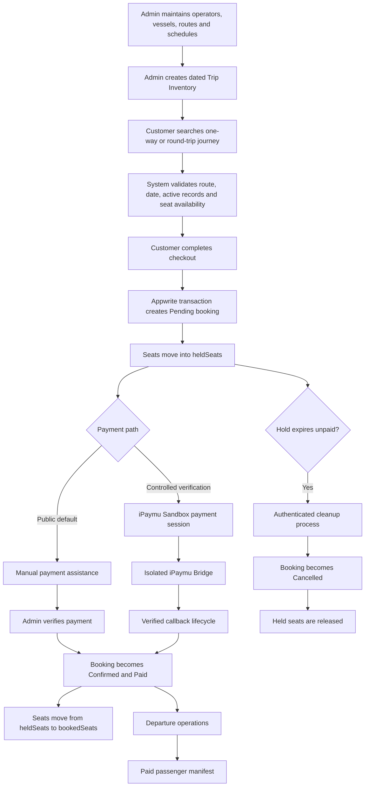
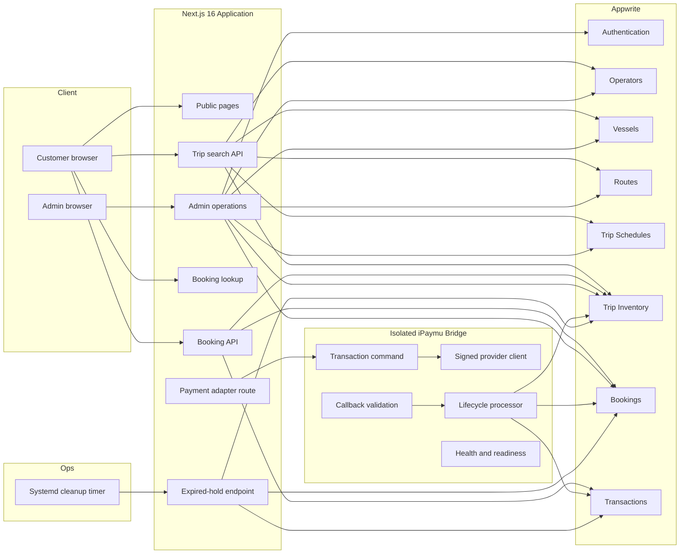

# GiliGo — Fast Boat Booking Operations Platform

> An operational booking system that turns trip scheduling, seat availability, customer booking, payment follow-up, departure preparation, and passenger manifest reporting into one structured digital workflow.

[](https://nextjs.org/)
[](https://www.typescriptlang.org/)
[](https://appwrite.io/)
[](#current-status)
[](#payment-scope)

**Status:** Production-deployed operational MVP  
**Project type:** Independent business systems portfolio project  
**Public payment flow:** Manual payment assistance with admin verification  
**Payment engineering:** Controlled iPaymu Sandbox integration  
**Operational data:** Demonstration data  
**Maintenance:** Active

## Live Demo

- **Public website:** https://nusagiliboat.com
- **Admin portal:** https://nusagiliboat.com/admin

> Admin credentials are private. The public deployment uses demonstration schedules, inventory, operators, prices, bookings, and transactions. It is not presented as a live commercial marketplace connected to real fast boat operators.

---

## Project Overview

GiliGo is a fast boat booking and operations platform designed around routes between Bali, Lombok, the Gili Islands, and Nusa Penida.

The project began as a customer booking MVP and evolved into a broader operational system covering:

- trip master data;
- dated trip inventory;
- real-time seat availability calculations;
- one-way and round-trip bookings;
- temporary seat holds;
- payment follow-up and verification;
- booking lifecycle management;
- daily departure control;
- paid passenger manifests;
- operational dashboard reporting.

The main engineering goal was not only to create a booking form, but to model the business rules that keep booking, payment, inventory, departure, and manifest data consistent.

---

## Business Problem

A fast boat booking operation has several connected processes that can become fragmented when handled through spreadsheets, chat messages, and manual records:

1. Schedules, vessels, routes, prices, and departure dates must remain current.
2. Available seats must account for both confirmed bookings and customers who are still completing payment.
3. One-way and round-trip bookings must reserve the correct inventory.
4. Unpaid bookings should not hold capacity indefinitely.
5. Booking and payment statuses must follow valid operational transitions.
6. Departure staff need a clear view of upcoming trips and passenger totals.
7. Provider manifests should contain only passengers whose bookings are operationally valid and paid.

GiliGo converts those requirements into a structured application workflow.

---

## Solution

The system separates reusable master data from dated operational inventory.

### Master data

Administrators manage:

- operators;
- vessels;
- routes;
- recurring trip schedules.

### Operational data

Administrators create and maintain Trip Inventory records containing:

- travel date;
- operator, vessel, route, and schedule references;
- departure and arrival time;
- seat capacity;
- booked seats;
- held seats;
- adult, child, and infant pricing;
- currency;
- sales status;
- active/inactive state.

Only active, open inventory with enough remaining seats can appear in customer search results.

---

## Operational Workflow



---

## Key Capabilities

### Customer Booking

- Search one-way and round-trip journeys.
- Select origin, destination, travel date, and passenger count.
- Display only active inventory with `OPEN` sales status and sufficient seats.
- Compare operator, vessel, schedule, travel time, price, and remaining availability.
- Validate that a return journey reverses the outbound route.
- Validate that the return date is later than the departure date.
- Collect customer and passenger details.
- Create a unique booking reference.
- Store outbound and return-trip snapshots for booking continuity.
- Look up a booking using booking code and customer email.
- Display booking, payment, trip, passenger, and seat-hold information.

### Seat Inventory

- Calculate available seats as:

```text
availableSeats = seatCapacity - bookedSeats - heldSeats
```

- Place newly created bookings into `heldSeats`.
- Prevent a booking when remaining capacity changes during processing.
- Automatically mark an inventory record `SOLD_OUT` when no seats remain.
- Move seats from held to booked when a booking becomes confirmed.
- Release held or booked seats when operational status changes require it.
- Support outbound and return inventory adjustments in one transaction.
- Reopen automatically sold-out inventory when expired holds are released and seats become available.

### Booking Operations

Supported booking statuses:

- `Pending`
- `Confirmed`
- `Completed`
- `Cancelled`

Supported payment statuses:

- `Demo`
- `Pending`
- `Paid`
- `Refunded`

The admin workflow validates status transitions and rejects incompatible booking/payment combinations.

### Admin Operations

- Secure administrator login.
- Protected admin routes and APIs.
- Search bookings by booking code, customer, contact details, operator, or route.
- Filter by booking status, payment status, and departure date.
- View booking, customer, passenger, route, vessel, payment, and inventory details.
- Update booking and payment statuses.
- Adjust held and booked seats transactionally when statuses change.
- Manage operators, vessels, routes, schedules, and dated trip inventory.
- Review upcoming departures using WITA operational dates.
- Open a departure-specific passenger manifest.
- Print a provider-ready manifest.

### Operational Dashboard

The dashboard surfaces:

- pending customer payment follow-up;
- paid bookings ready for manifest reporting;
- today's departures;
- today's passengers;
- tomorrow's booking and passenger totals;
- next seven days of booking and passenger activity;
- searchable and filterable booking records.

### Passenger Manifest

The provider manifest includes only bookings that satisfy both conditions:

```text
bookingStatus is Confirmed or Completed
AND
paymentStatus is Paid
```

This prevents unpaid, cancelled, or otherwise incomplete bookings from appearing in the final provider report.

---

## Core Business Rules

### 1. Trip visibility

A journey is searchable only when:

- the inventory record is active;
- its sales status is `OPEN`;
- its date is still bookable;
- its linked schedule, operator, vessel, and route are active;
- the requested passenger count does not exceed remaining seats.

### 2. Seat hold

A new booking starts as:

```text
bookingStatus = Pending
paymentStatus = Pending
```

The booking temporarily reserves seats in `heldSeats`.

The default hold duration is 30 minutes and can be configured between 5 and 1,440 minutes.

### 3. Status-to-seat mapping

| Booking status | Seat position |
|---|---|
| `Pending` | Held |
| `Confirmed` | Booked |
| `Completed` | Booked |
| `Cancelled` | Released |

### 4. Expired bookings

An authenticated cleanup endpoint processes expired `Pending/Pending` bookings.

For each valid expired booking, the system:

1. loads the booking inside an Appwrite transaction;
2. verifies that it is still pending and expired;
3. releases outbound and return held seats;
4. reopens automatically sold-out inventory when appropriate;
5. changes the booking to `Cancelled`;
6. keeps payment status as `Pending`;
7. commits the changes atomically.

Systemd service and timer definitions are included for a five-minute cleanup schedule, but activation depends on deployment-side verification and secret configuration.

### 5. Manifest eligibility

Only verified paid sales are included:

```text
(Confirmed OR Completed) AND Paid
```

---

## Payment Scope

### Public customer flow

The public website currently presents manual payment assistance. Customers request payment instructions and the booking is confirmed after admin verification.

### Controlled iPaymu integration

The repository also contains an isolated iPaymu Bridge for controlled Sandbox verification.

The bridge includes:

- signed redirect-payment requests;
- HTTPS-only return and callback URLs;
- internal bearer-token protection;
- callback signature validation;
- JSON and URL-encoded callback support;
- idempotency handling;
- atomic booking and inventory lifecycle updates;
- duplicate callback handling;
- late-success/manual-review handling;
- request-size limits;
- timeout handling;
- health and readiness endpoints;
- sanitized transport and authorization observability;
- fail-closed configuration.

The iPaymu path should be described as a tested Sandbox integration, not as the default public production payment flow.

---

## Architecture



---

## Engineering Decisions

### Transactional seat lifecycle

Booking creation, status changes, callback processing, and expired-hold cleanup use Appwrite transactions to reduce the risk of booking and inventory becoming inconsistent.

### Separate master data and dated inventory

Routes and recurring schedules are reusable. Date-specific price, capacity, availability, and sales status belong to Trip Inventory.

This separation reflects how an operator can keep the same route and schedule while changing availability, price, vessel assignment, or sales status for a particular date.

### Snapshot important booking details

Bookings preserve trip details such as route, operator, vessel, times, price, and check-in location. This protects the booking record from later master-data changes.

### Fail-closed payment verification

Online payment verification remains restricted when configuration is absent or invalid. Only explicitly eligible bookings can access the controlled iPaymu path.

### Isolated payment bridge

Provider credentials, signatures, callbacks, and transport logic are separated from the public Next.js application into a containerized server-side service.

### Operational timezone

Departure and dashboard calculations use `Asia/Makassar` (WITA), matching Bali operational dates rather than relying on the server's default timezone.

### Read-only manifest reporting

The manifest is generated from booking data and does not mutate operational records. Its eligibility rule is deliberately stricter than a general booking list.

---

## Security and Reliability

- Server-side Appwrite API access.
- Appwrite Auth for administrator sessions.
- HttpOnly session cookies.
- `Secure` cookies in production.
- `SameSite=Strict` session policy.
- Admin email allow-list.
- Protected admin pages and mutation APIs.
- No-store responses for booking and payment lookups.
- Constant-time comparison for cleanup authorization.
- Minimum-length cleanup secret.
- HTTPS validation for payment and callback URLs.
- Internal bearer token between the web application and payment bridge.
- Callback signature verification.
- Maximum 64 KiB bridge request body.
- Provider timeout and transport-error handling.
- Sanitized logs that avoid exposing secrets.
- Transaction rollback paths for booking, inventory, and payment lifecycle failures.

---

## Technology Stack

| Area | Technology |
|---|---|
| Web framework | Next.js 16 App Router |
| Language | TypeScript 5 |
| UI | React 19 |
| Styling | Tailwind CSS 4 |
| Application APIs | Next.js Route Handlers |
| Operational database | Appwrite TablesDB |
| Authentication | Appwrite Auth |
| Payment service | Node.js iPaymu Bridge |
| Payment environment | iPaymu Sandbox |
| Payment service packaging | Docker |
| Scheduled cleanup | Bash and systemd |
| Frontend deployment | Vercel |
| Timezone | Asia/Makassar (WITA) |
| Version control | Git and GitHub |

---

## Validation

Validation performed against commit:

```text
e6447210dae2ae701c432a2871599f3742c055b7
```

Results:

| Check | Result |
|---|---|
| ESLint | Passed with 0 errors and 1 image-optimization warning |
| TypeScript `tsc --noEmit` | Passed |
| Next.js production build | Passed |
| Static pages generated | 21 |
| iPaymu Bridge automated tests | 106 passed |
| Failed bridge tests | 0 |
| Skipped bridge tests | 0 |

The iPaymu Bridge test suite covers configuration, signatures, redirect requests, provider responses, authorization guards, callbacks, runtime wiring, observability, booking lookup, seat transitions, duplicate events, rollback behavior, and late-payment review cases.

> The main Next.js application does not yet have an equivalent automated test suite. Its current validation relies on linting, TypeScript checks, production builds, and manual workflow testing.

---

## Application Routes

The current build includes:

- 28 application pages;
- 19 API routes;
- 11 protected admin pages;
- bilingual information and policy pages;
- dynamic booking, search, departure, and manifest routes.

Main API areas:

| Area | Routes |
|---|---|
| Admin authentication | `/api/admin/login`, `/api/admin/logout` |
| Master data | Operators, vessels, routes, schedules, inventory |
| Booking | Creation, lookup, and status updates |
| Search | Trip search and trip detail |
| Payment | iPaymu payment-session adapter |
| Operations | Expired held-booking cleanup |

---

## Project Structure

```text
.
├── ops/
│   └── systemd/                 # Held-seat cleanup scheduler
├── public/
│   └── brand/                   # Project branding
├── scripts/
│   └── run-expired-seat-cleanup.sh
├── services/
│   └── ipaymu-bridge/
│       ├── src/                 # Payment, callback and runtime logic
│       ├── test/                # Node test suite
│       └── Dockerfile
└── src/
    ├── app/
    │   ├── admin/               # Dashboard and operational management
    │   ├── api/                 # Application APIs
    │   ├── booking/             # Booking lookup and payment actions
    │   ├── checkout/
    │   ├── search/
    │   └── id/                  # Indonesian information pages
    ├── components/
    ├── data/
    └── lib/                     # Auth, Appwrite, WITA, payment and seat rules
```

---

## Screenshots Planned for the Final README

The final portfolio presentation should include:

1. Public search and route selection.
2. One-way and round-trip results.
3. Passenger checkout.
4. Booking confirmation and manual payment assistance.
5. Admin operational dashboard.
6. Trip Inventory management.
7. Booking detail and status controls.
8. Departure control page.
9. Paid passenger manifest.
10. Printed manifest layout.

Screenshot files should be stored under:

```text
docs/screenshots/
```

Recommended naming:

```text
01-public-search.png
02-trip-results.png
03-checkout.png
04-booking-confirmation.png
05-admin-dashboard.png
06-trip-inventory.png
07-booking-operations.png
08-departures.png
09-paid-manifest.png
10-manifest-print.png
```

---

## Current Status

GiliGo is best described as a **production-deployed operational MVP**.

It is production-deployed because the public application is available on its own domain and the operational application can be built successfully for production.

It remains an MVP because:

- the public deployment uses demonstration operational data;
- it is not connected to real fast boat operators;
- public payment defaults to manual assistance;
- iPaymu is implemented as a controlled Sandbox path;
- some planned customer and operations features are not yet complete.

---

## Known Limitations

- No connection to real operator APIs or live provider schedules.
- Public schedules, inventory, operators, prices, bookings, and transactions are demonstration data.
- Public payment is manual; iPaymu is a controlled Sandbox integration.
- No automated booking email notification service.
- No downloadable PDF/PNG customer ticket.
- No QR ticket verification workflow.
- No comprehensive automated test suite for the main Next.js application.
- Booking-code uniqueness is not yet enforced by a database unique index; the payment path rejects ambiguous duplicate results.
- The root `.env.example` still contains obsolete Midtrans variables and does not document all current Appwrite, inventory, cleanup, and iPaymu settings.
- `services/ipaymu-bridge/README.md` still describes an early disabled scaffold and must be updated to match version `0.18.0`.
- The repository does not yet have a formal GitHub release or version tag.
- One remaining lint warning recommends replacing a homepage `` element with Next.js Image optimization.

---

## Documentation Work Required Before Portfolio Release

Before replacing the public README, complete these documentation tasks:

- [ ] Update `.env.example`.
- [ ] Update the iPaymu Bridge README.
- [ ] Add final screenshots.
- [ ] Add a concise architecture image or retain the Mermaid diagram.
- [ ] Decide and add a license.
- [ ] Add GitHub repository topics.
- [ ] Update the repository description.
- [ ] Create a portfolio release tag after final validation.
- [ ] Replace the old root README only after review.

---

## My Role

I designed and developed GiliGo as an independent business systems project.

My work included:

- translating a manual booking process into application workflows;
- defining booking, payment, inventory, and manifest rules;
- designing the Appwrite data model;
- building the public booking journey;
- building protected admin operations;
- implementing master-data and inventory management;
- implementing transactional seat holds and releases;
- designing WITA-based operational dashboard metrics;
- building departure and manifest workflows;
- isolating the iPaymu integration into a server-side bridge;
- adding callback verification, lifecycle safeguards, and observability;
- preparing deployment, scheduler, and rollback documentation;
- validating the application through lint, TypeScript, production builds, runtime checks, and automated bridge tests.

---

## Lessons Learned

### Model the business process before adding features

The most important work was defining how schedules, dated inventory, booking statuses, payment statuses, seat positions, and manifests relate to one another.

### Payment integration is an operational lifecycle

A successful payment response is not enough. The system must also handle callback authentication, duplicate events, expired bookings, seat release, late success, rollback, and manual review.

### Inventory requires temporary state

Using only available and booked seats is insufficient when customers need time to complete payment. A separate held-seat state makes capacity management safer.

### Portfolio honesty increases credibility

The system is intentionally presented as a deployed operational portfolio MVP with demonstration data and Sandbox payment engineering—not as a live commercial marketplace.

---

## Local Development

### Requirements

- Node.js 24
- npm 11
- Appwrite project with the required TablesDB tables
- An Appwrite administrator user
- Optional Docker runtime for the iPaymu Bridge

### Install

```bash
git clone https://github.com/loctate/giligo-fast-boat-booking.git
cd giligo-fast-boat-booking
npm install
```

### Required application configuration

The application uses environment variables for:

- Appwrite endpoint, project, API key, database, and table IDs;
- administrator email and session cookie;
- support contact details;
- seat-hold duration;
- cleanup authorization;
- controlled payment verification;
- public application URL;
- iPaymu Bridge URL and internal token.

Do not commit actual secrets.

> The repository's `.env.example` must be updated before it is treated as the authoritative local setup reference.

### Run

```bash
npm run dev
```

### Validate

```bash
npm run lint
npx --no-install tsc --noEmit
npm run build
npm --prefix services/ipaymu-bridge test
```

---

## Roadmap

The roadmap is limited to features that strengthen the operational workflow:

- automated booking email notifications;
- customer ticket export as PDF or PNG;
- QR-based ticket verification;
- automated tests for the main Next.js application;
- stronger database-level booking-code uniqueness;
- final production-readiness documentation;
- optional integration with real operator inventory sources.

---

## Author

**Bonar Sulaiman**

- GitHub: [@loctate](https://github.com/loctate)
- LinkedIn: [linkedin.com/in/bonarsulaiman](https://www.linkedin.com/in/bonarsulaiman/)

---

Built to demonstrate how a manual travel-booking operation can be transformed into a practical digital system.
