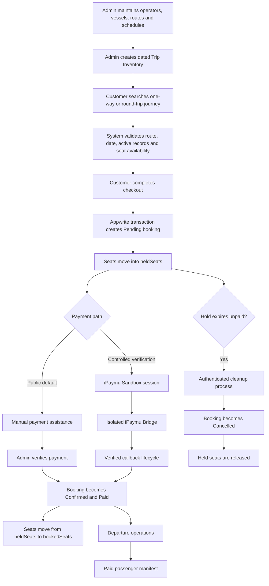
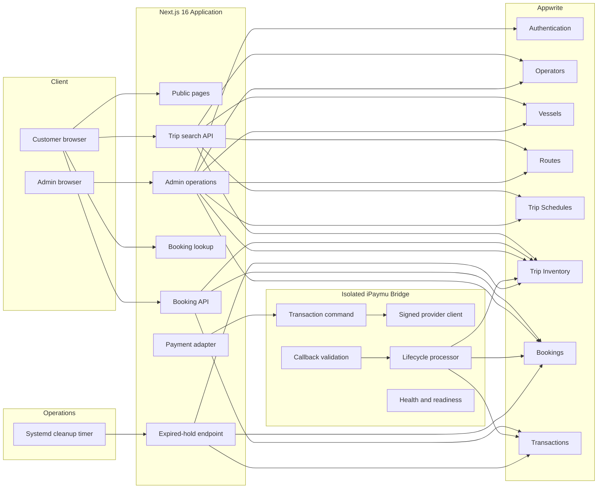

<p align="center">
  
</p>

# GiliGo — Fast Boat Booking Operations Platform

> An operational booking system that transforms trip scheduling, seat availability, customer booking, payment follow-up, departure preparation, and passenger manifest reporting into one structured digital workflow.

[](https://nextjs.org/)
[](https://www.typescriptlang.org/)
[](https://appwrite.io/)
[](#current-status)
[](#payment-scope)

| Portfolio status | Details |
|---|---|
| **Project status** | Production-deployed operational MVP |
| **Project type** | Independent business systems portfolio project |
| **Public payment flow** | Manual payment assistance with admin verification |
| **Payment engineering** | Controlled iPaymu Sandbox integration |
| **Operational data** | Demonstration data |
| **Maintenance** | Active |

## Live Demo

- **Public website:** https://nusagiliboat.com
- **Admin portal:** https://nusagiliboat.com/admin

> Admin credentials are private. The public deployment uses demonstration schedules, inventory, operators, prices, bookings, and transactions. It is not presented as a live commercial marketplace connected to real fast boat operators.

---

## Project Overview

GiliGo is a fast boat booking and operations platform designed around routes between Bali, Lombok, the Gili Islands, and Nusa Penida.

The project began as a customer booking MVP and evolved into an operational system covering:

- operator, vessel, route, and schedule master data;
- dated trip inventory;
- real-time seat availability;
- one-way and round-trip bookings;
- temporary seat holds;
- payment follow-up and verification;
- booking lifecycle management;
- departure operations;
- paid passenger manifests;
- operational dashboard reporting.

The main engineering goal was not simply to build a booking form. It was to model the business rules that keep booking, payment, inventory, departure, and manifest records consistent.

---

## Business Problem

A fast boat operation has several connected processes that can become fragmented when managed through spreadsheets, chat messages, and separate manual records:

1. Schedules, vessels, routes, prices, and departure dates must stay current.
2. Available seats must include both confirmed sales and customers still completing payment.
3. One-way and round-trip bookings must reserve the correct inventory.
4. Unpaid bookings must not hold capacity indefinitely.
5. Booking and payment statuses must follow valid operational transitions.
6. Departure staff need a reliable view of upcoming trips and passenger totals.
7. Provider manifests should contain only operationally valid and paid passengers.

GiliGo converts those requirements into a structured application workflow.

---

## Solution at a Glance

### Reusable master data

Administrators manage:

- operators;
- vessels;
- routes;
- recurring trip schedules.

### Dated operational inventory

Trip Inventory records contain:

- travel date;
- operator, vessel, route, and schedule references;
- departure and arrival time;
- seat capacity;
- booked and held seats;
- adult, child, and infant pricing;
- currency;
- sales status;
- active or inactive state.

Only active and open inventory with enough remaining seats appears in customer search results.

---

## Operational Workflow



---

## Key Capabilities

### Customer booking

- Search one-way and round-trip journeys.
- Select origin, destination, dates, and passenger count.
- Show only active inventory with `OPEN` sales status and sufficient capacity.
- Compare operator, vessel, schedule, duration, price, and remaining seats.
- Validate reversed routes for return journeys.
- Validate that the return date is later than the departure date.
- Collect customer and passenger information.
- Create a unique booking reference.
- Preserve trip snapshots inside booking records.
- Look up a booking using booking code and customer email.
- Display booking, payment, trip, passenger, and seat-hold details.

### Seat inventory

Available seats are calculated as:

```text
availableSeats = seatCapacity - bookedSeats - heldSeats
```

The system can:

- place new bookings into `heldSeats`;
- reject a booking when capacity changes during processing;
- mark inventory `SOLD_OUT` when no seats remain;
- move seats from held to booked after confirmation;
- release held or booked seats when required;
- update outbound and return inventory in one transaction;
- reopen automatically sold-out inventory after expired holds are released.

### Booking operations

Supported booking statuses:

- `Pending`
- `Confirmed`
- `Completed`
- `Cancelled`

Supported payment statuses:

- `Demo`
- `Pending`
- `Paid`
- `Refunded`

The admin workflow validates transitions and rejects incompatible booking and payment combinations.

### Administration

- Secure administrator authentication.
- Protected admin pages and mutation APIs.
- Search by booking code, customer, contact details, operator, or route.
- Filter by booking status, payment status, and departure date.
- View booking, customer, passenger, route, vessel, payment, and inventory data.
- Update booking and payment statuses.
- Adjust held and booked seats transactionally.
- Manage operators, vessels, routes, schedules, and dated inventory.
- Review upcoming departures using WITA operational dates.
- Open and print departure-specific passenger manifests.

### Operational dashboard

The dashboard surfaces:

- bookings awaiting payment follow-up;
- paid bookings ready for manifest reporting;
- today's departures and passengers;
- tomorrow's booking and passenger totals;
- the next seven days of operational activity;
- searchable and filterable booking records.

### Passenger manifest

The provider manifest includes only bookings that satisfy both conditions:

```text
bookingStatus is Confirmed or Completed
AND
paymentStatus is Paid
```

This prevents unpaid, cancelled, or incomplete bookings from appearing in the final provider report.

---

## Core Business Rules

### Trip visibility

A journey is searchable only when:

- the inventory record is active;
- its sales status is `OPEN`;
- its date is still bookable;
- its related schedule, operator, vessel, and route are active;
- the requested passenger count fits the remaining capacity.

### Seat hold

A new booking starts as:

```text
bookingStatus = Pending
paymentStatus = Pending
```

Its seats are temporarily stored in `heldSeats`.

The default hold duration is 30 minutes and can be configured between 5 and 1,440 minutes.

### Status-to-seat mapping

| Booking status | Seat position |
|---|---|
| `Pending` | Held |
| `Confirmed` | Booked |
| `Completed` | Booked |
| `Cancelled` | Released |

### Expired bookings

An authenticated cleanup endpoint processes expired `Pending/Pending` bookings.

For each valid booking, the system:

1. loads the booking inside an Appwrite transaction;
2. verifies that it is still pending and expired;
3. releases outbound and return held seats;
4. reopens eligible automatically sold-out inventory;
5. changes the booking to `Cancelled`;
6. keeps payment status as `Pending`;
7. commits the updates atomically.

Systemd service and timer definitions are included for a five-minute cleanup schedule. Activation requires deployment-side endpoint, database, permission, and secret verification.

### Manifest eligibility

Only verified paid sales are included:

```text
(Confirmed OR Completed) AND Paid
```

---

## Payment Scope

### Public customer flow

The public website currently presents manual payment assistance. Customers request payment instructions and the booking is confirmed after administrator verification.

### Controlled iPaymu integration

The repository also contains an isolated iPaymu Bridge for controlled Sandbox verification.

The bridge includes:

- signed redirect-payment requests;
- HTTPS-only provider and callback URLs;
- internal bearer-token protection;
- callback signature validation;
- JSON and URL-encoded callback support;
- idempotency handling;
- transactional booking and seat lifecycle updates;
- duplicate callback handling;
- late-success and manual-review handling;
- request-size limits;
- provider timeout handling;
- health and readiness endpoints;
- sanitized transport and authorization diagnostics;
- fail-closed configuration.

The iPaymu path is presented as a tested Sandbox integration, not as the default public production payment flow.

More details are available in [`services/ipaymu-bridge/README.md`](services/ipaymu-bridge/README.md).

---

## Architecture



---

## Engineering Decisions

### Transactional seat lifecycle

Booking creation, status changes, payment callbacks, and expired-hold cleanup use Appwrite transactions to reduce the risk of inconsistent booking and inventory records.

### Separate master data and dated inventory

Routes and recurring schedules are reusable. Date-specific price, capacity, availability, vessel assignment, and sales status belong to Trip Inventory.

### Booking snapshots

Bookings preserve route, operator, vessel, time, price, and check-in information so later master-data changes do not rewrite historical booking details.

### Fail-closed payment verification

Online payment remains restricted when configuration is missing or invalid. Only explicitly eligible bookings can enter the controlled iPaymu path.

### Isolated payment bridge

Provider credentials, signatures, callbacks, and transport logic are separated from the public Next.js application into a containerized server-side service.

### Operational timezone

Dashboard and departure calculations use `Asia/Makassar` (WITA), matching Bali operational dates rather than the server's default timezone.

### Read-only manifest reporting

Manifest generation reads qualifying booking data without changing operational records.

---

## Security and Reliability

- Server-side Appwrite API access.
- Appwrite Auth administrator sessions.
- HttpOnly session cookies.
- `Secure` cookies in production.
- `SameSite=Strict` session policy.
- Administrator email allow-list.
- Protected admin pages and mutation APIs.
- No-store booking and payment lookup responses.
- Constant-time cleanup-secret comparison.
- Minimum cleanup-secret length.
- HTTPS validation for payment and callback URLs.
- Internal bearer token between the web application and payment bridge.
- Callback signature verification.
- Maximum 64 KiB bridge request body.
- Provider timeout and transport-error handling.
- Sanitized logs that avoid exposing secrets.
- Transaction rollback paths for booking, inventory, and payment failures.
- Non-root payment-service container.

---

## Technology Stack

| Area | Technology |
|---|---|
| Web framework | Next.js 16 App Router |
| Language | TypeScript 5 |
| UI | React 19 |
| Styling | Tailwind CSS 4 |
| Application APIs | Next.js Route Handlers |
| Operational database | Appwrite TablesDB |
| Authentication | Appwrite Auth |
| Payment service | Node.js iPaymu Bridge |
| Payment environment | iPaymu Sandbox |
| Payment packaging | Docker |
| Scheduled cleanup | Bash and systemd |
| Frontend deployment | Vercel |
| Operational timezone | Asia/Makassar (WITA) |
| Version control | Git and GitHub |

---

## Validation

Validation was performed against:

```text
e6447210dae2ae701c432a2871599f3742c055b7
```

| Check | Result |
|---|---|
| ESLint | Passed with 0 errors and 1 image-optimization warning |
| TypeScript `tsc --noEmit` | Passed |
| Next.js production build | Passed |
| Static pages generated | 21 |
| Application pages in source | 28 |
| API routes in source | 19 |
| Protected admin pages | 11 |
| iPaymu Bridge tests | 106 passed |
| Failed bridge tests | 0 |
| Skipped bridge tests | 0 |

The bridge test suite covers configuration, signatures, payment requests, provider responses, authorization guards, callbacks, runtime wiring, observability, booking lookup, seat transitions, duplicate events, rollback behavior, and late-payment review cases.

> The main Next.js application does not yet have an equivalent automated test suite. Its current validation relies on linting, TypeScript checks, production builds, and manual workflow testing.

---

## Project Structure

```text
.
├── ops/
│   └── systemd/                 # Held-seat cleanup scheduler
├── public/
│   └── brand/                   # Project branding
├── scripts/
│   └── run-expired-seat-cleanup.sh
├── services/
│   └── ipaymu-bridge/
│       ├── src/                 # Payment and callback lifecycle
│       ├── test/                # Node test suite
│       └── Dockerfile
└── src/
    ├── app/
    │   ├── admin/               # Dashboard and operations
    │   ├── api/                 # Application APIs
    │   ├── booking/             # Lookup and payment actions
    │   ├── checkout/
    │   ├── search/
    │   └── id/                  # Indonesian information pages
    ├── components/
    ├── data/
    └── lib/                     # Auth, Appwrite, WITA, payment and seat rules
```

<!--
Product screenshots will be inserted here after the final capture and review.
Expected directory: docs/screenshots/
-->

---

## Current Status

GiliGo is best described as a **production-deployed operational MVP**.

It is production-deployed because the public application is available on its own domain and the application passes a production build.

It remains an MVP because:

- the public deployment uses demonstration operational data;
- it is not connected to real fast boat operators;
- public payment defaults to manual assistance;
- iPaymu is implemented as a controlled Sandbox path;
- several customer-facing operational features remain on the roadmap.

---

## Known Limitations

- No integration with real operator APIs or live provider schedules.
- Public schedules, inventory, operators, prices, bookings, and transactions are demonstration data.
- Public payment is manual; iPaymu is a controlled Sandbox integration.
- No automated booking email-notification service.
- No downloadable PDF or PNG customer ticket.
- No QR-based ticket verification.
- No comprehensive automated test suite for the main Next.js application.
- Booking-code uniqueness is not yet enforced by a database unique index; the payment path rejects ambiguous duplicate results.
- One lint warning remains for a homepage `` element that could use Next.js image optimization.

---

## My Role

I designed and developed GiliGo as an independent business systems project.

My work included:

- translating a manual booking process into application workflows;
- defining booking, payment, inventory, departure, and manifest rules;
- designing the Appwrite data model;
- building the public booking journey;
- building protected administrator operations;
- implementing master-data and inventory management;
- implementing transactional seat holds and releases;
- designing WITA-based operational dashboard metrics;
- building departure and manifest workflows;
- isolating the iPaymu integration into a server-side bridge;
- implementing callback validation, lifecycle safeguards, and observability;
- preparing deployment, scheduler, and rollback documentation;
- validating the system through linting, TypeScript, production builds, runtime checks, and automated bridge tests.

---

## Lessons Learned

### Model the business process before adding features

The most important work was defining how schedules, dated inventory, booking statuses, payment statuses, seat positions, and manifests relate to one another.

### Payment integration is an operational lifecycle

A successful provider request is not enough. The system must also handle callback authentication, duplicate events, expiration, seat release, late success, rollback, and manual review.

### Inventory requires temporary state

Using only available and booked seats is insufficient while customers are completing payment. A separate held-seat state makes capacity management safer.

### Honest positioning increases portfolio credibility

The system is presented as a deployed operational portfolio MVP with demonstration data and Sandbox payment engineering, not as a live commercial marketplace.

---

## Local Development

### Requirements

- Node.js 24
- npm 11
- Appwrite project with the required TablesDB tables
- Appwrite administrator account
- Optional Docker runtime for the iPaymu Bridge

### Installation

```bash
git clone https://github.com/loctate/giligo-fast-boat-booking.git
cd giligo-fast-boat-booking
npm install
cp .env.example .env.local
```

Add private development values to `.env.local`. Never commit real credentials or production secrets.

### Run the application

```bash
npm run dev
```

### Validate the application

```bash
npm run lint
npx --no-install tsc --noEmit
npm run build
npm --prefix services/ipaymu-bridge test
```

See [`services/ipaymu-bridge/README.md`](services/ipaymu-bridge/README.md) for payment-service setup and validation.

---

## Roadmap

- Automated booking email notifications.
- Customer ticket export as PDF or PNG.
- QR-based ticket verification.
- Automated tests for the main Next.js application.
- Database-level booking-code uniqueness.
- Final production-readiness documentation.
- Optional real operator inventory integrations.

---

## Author

**Bonar Sulaiman**

- GitHub: [@loctate](https://github.com/loctate)
- LinkedIn: [linkedin.com/in/bonarsulaiman](https://www.linkedin.com/in/bonarsulaiman/)

---

Built to demonstrate how a manual travel-booking operation can be transformed into a practical digital system.
