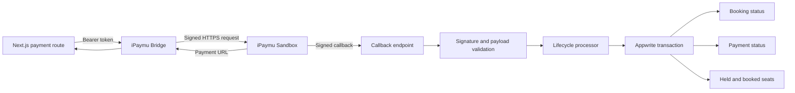

# NusaGiliBoat iPaymu Bridge

> An isolated server-side payment service for controlled iPaymu Sandbox verification, callback validation, and transactional booking-seat lifecycle updates.

**Service:** `nusagiliboat-ipaymu-bridge`<br>
**Version:** `0.18.0`<br>
**Runtime:** Node.js 24 or newer<br>
**Current project use:** Controlled iPaymu Sandbox integration<br>
**Default safety state:** Disabled until explicitly configured

## Purpose

The bridge separates payment-provider credentials and callback processing from the public Next.js application.

It is responsible for:

- creating signed iPaymu redirect-payment requests;
- authenticating internal transaction requests;
- validating provider callback signatures;
- normalizing callback payloads;
- applying payment and seat-lifecycle changes through Appwrite transactions;
- handling duplicate, expired, and late payment events;
- exposing health and readiness endpoints;
- emitting sanitized operational diagnostics without exposing credentials.

The bridge is not the default public payment experience on the current GiliGo deployment. Public customers currently receive manual payment assistance, while this service supports a controlled Sandbox verification path.

## Service Flow



## Endpoints

The default prefix is:

```text
/ipaymu-bridge
```

| Method | Endpoint | Purpose |
|---|---|---|
| `GET` | `/ipaymu-bridge/health` | Reports service identity, version, environment, and enabled state |
| `GET` | `/ipaymu-bridge/ready` | Reports whether all required runtime configuration is present |
| `POST` | `/ipaymu-bridge/transactions` | Creates an iPaymu redirect-payment session for an authenticated internal request |
| `POST` | `/ipaymu-bridge/callback` | Validates and processes an iPaymu payment callback |

`/ready` returns HTTP `200` only when the bridge is enabled and all required configuration is complete. Otherwise it returns HTTP `503` with the missing configuration names.

## Payment Lifecycle

The callback processor maps provider events into controlled booking and inventory transitions.

### Successful payment

For a booking currently in:

```text
bookingStatus = Pending
paymentStatus = Pending
```

a valid success callback applies:

```text
bookingStatus = Confirmed
paymentStatus = Paid
seatAction = held-to-booked
```

### Expired payment

For an unpaid pending booking, an expired callback applies:

```text
bookingStatus = Cancelled
paymentStatus = Pending
seatAction = release-held
```

### Duplicate callback

A success callback received for an already confirmed and paid booking is treated as a duplicate no-op.

### Late success

A successful callback received after a booking has been cancelled and its seats released does not automatically rebook the seats. It is marked for manual review.

### Stale or unknown events

Stale pending events and unknown callback states do not overwrite a later valid booking state.

## Transactional Appwrite Updates

The bridge uses Appwrite transactions when applying callback results.

Depending on the lifecycle plan, it can:

- look up one booking by booking code;
- reject missing or non-unique booking results;
- verify that callback reference and booking code match;
- update outbound inventory;
- update return inventory for round-trip bookings;
- move seats from `heldSeats` to `bookedSeats`;
- release held seats;
- reopen eligible automatically sold-out inventory;
- update booking and payment statuses;
- roll back when a mutation fails.

## Security Controls

- Disabled by default.
- Server-side provider credentials only.
- No `NEXT_PUBLIC_*` payment credentials.
- Internal bearer-token authentication for transaction creation.
- Constant-time token comparison.
- iPaymu request signatures.
- Callback signature verification.
- HTTPS-only provider, return, cancel, and notification URLs.
- Maximum request body size of 64 KiB.
- JSON-only internal transaction requests.
- JSON and URL-encoded callback support.
- Duplicate callback protection through deterministic idempotency data.
- Provider request timeout handling.
- No-store JSON responses.
- Request correlation IDs.
- Sanitized transport diagnostics.
- Sanitized authorization-rejection diagnostics.
- Health and readiness responses that do not expose secrets.
- Non-root Docker runtime.

## Configuration

Start from:

```text
services/ipaymu-bridge/config.example.env
```

Required variables when the bridge is enabled:

| Variable | Purpose |
|---|---|
| `IPAYMU_ENABLED` | Enables or disables write operations |
| `IPAYMU_ENVIRONMENT` | `sandbox` or `production` |
| `IPAYMU_API_BASE_URL` | HTTPS iPaymu API base URL |
| `IPAYMU_VA` | Server-side iPaymu virtual account identifier |
| `IPAYMU_API_KEY` | Server-side iPaymu API key |
| `IPAYMU_BRIDGE_INTERNAL_TOKEN` | Shared secret used by the Next.js application |
| `APPWRITE_ENDPOINT` | Appwrite API endpoint |
| `APPWRITE_PROJECT_ID` | Appwrite project identifier |
| `APPWRITE_API_KEY` | Server-side Appwrite API key |
| `APPWRITE_DATABASE_ID` | Operational database identifier |
| `APPWRITE_BOOKINGS_TABLE_ID` | Booking table identifier |
| `APPWRITE_TRIP_INVENTORY_TABLE_ID` | Dated trip-inventory table identifier |

Optional runtime settings:

| Variable | Default | Purpose |
|---|---:|---|
| `HOST` | `0.0.0.0` | Listening interface |
| `PORT` | `8080` | Listening port |
| `IPAYMU_BRIDGE_PREFIX` | `/ipaymu-bridge` | HTTP route prefix |

Never commit real credentials or production secrets.

## Local Validation

Install dependencies:

```bash
cd services/ipaymu-bridge
npm ci
```

Run the automated tests:

```bash
npm test
```

Run syntax checks and tests:

```bash
npm run check
```

The validated `0.18.0` service currently has:

```text
106 tests passed
0 tests failed
0 tests skipped
```

The suite covers:

- configuration and readiness;
- request and callback signatures;
- redirect-payment request construction;
- provider response validation;
- transport errors and timeouts;
- internal authorization;
- callback parsing and validation;
- runtime dependency wiring;
- Appwrite callback integration;
- held-to-booked transitions;
- expired-seat release;
- duplicate callbacks;
- rollback behavior;
- late-success manual review;
- sanitized observability.

## Running Locally

The service reads configuration from process environment variables.

Run it in the default disabled state:

```bash
cd services/ipaymu-bridge
npm start
```

Default local endpoints:

```text
http://127.0.0.1:8080/ipaymu-bridge/health
http://127.0.0.1:8080/ipaymu-bridge/ready
```

Example checks:

```bash
curl -sS http://127.0.0.1:8080/ipaymu-bridge/health
curl -sS -i http://127.0.0.1:8080/ipaymu-bridge/ready
```

In the default disabled state:

- `/health` remains available;
- `/ready` returns HTTP `503`;
- transaction and callback writes remain blocked.

To run an enabled environment, inject credentials from a private environment file or deployment secret store. Do not place real secrets in this repository.

## Docker

Build the service image:

```bash
cd services/ipaymu-bridge

docker build   -t nusagiliboat/ipaymu-bridge:0.18.0   .
```

Run the default disabled container:

```bash
docker run --rm   -p 8080:8080   nusagiliboat/ipaymu-bridge:0.18.0
```

For an enabled deployment, provide configuration through an external secret-managed environment file:

```bash
docker run --rm   --env-file /secure/path/ipaymu-bridge.env   -p 8080:8080   nusagiliboat/ipaymu-bridge:0.18.0
```

The image:

- uses `node:24-alpine`;
- installs production dependencies only;
- runs as the non-root `node` user;
- exposes port `8080`;
- includes an HTTP health check;
- remains disabled by default.

## Current Scope and Limitations

- The current portfolio implementation is verified against iPaymu Sandbox.
- It must not be described as the default live public payment flow.
- Production activation requires valid merchant approval, production credentials, deployment secrets, callback routing, and environment-specific verification.
- The bridge supports only the booking and trip-inventory records required by the current GiliGo lifecycle.
- Operational dashboards and provider reconciliation remain outside this service.
- Real credentials, production values, and private deployment details are intentionally excluded.

## Relationship to the Main Application

The Next.js application calls the bridge through its server-side payment adapter:

```text
POST /api/payments/ipaymu
```

The web application verifies booking eligibility and customer identity before sending a signed internal request to the bridge.

Related application variables:

```text
NUSAGILIBOAT_PUBLIC_BASE_URL
IPAYMU_BRIDGE_URL
IPAYMU_BRIDGE_INTERNAL_TOKEN
PAYMENT_VERIFICATION_MODE
PAYMENT_VERIFICATION_CODE_HASH
```

## Portfolio Positioning

This service demonstrates payment-integration engineering beyond simply creating a provider request. It addresses callback authentication, idempotency, transactional inventory changes, duplicate events, expired payments, late success, rollback, safe observability, and fail-closed configuration.

It should be presented as:

> A tested, isolated iPaymu Sandbox payment bridge for controlled verification and transactional booking-seat lifecycle processing.
